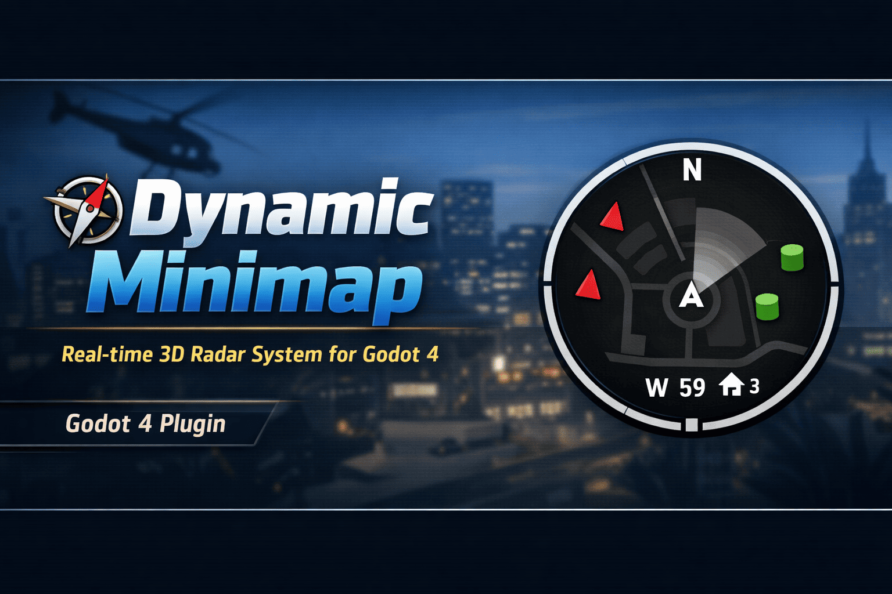

<h1 align="center">DynamicMinimap System (Godot 4.x)</h1>

<p align="center">
  <a href="https://godotengine.org/">
    
  </a>
  <a href="LICENSE">
    
  </a>
  <a href="https://github.com/SkooGamer/DynamicMinimap">
    
  </a>
</p>

<p align="center">
A real-time circular minimap system for Godot 4 featuring 3D world tracking, player rotation alignment, and edge clamping.
</p>

---

## 🆕 Version 1.1 Updates

- 🎨 Added icon system using the `IconType` feature (Color or 2D Texture)
- 📦 Added default preset icons (automatically loaded from the plugin folder)
- 🌍 Added 2D support (unified Node2D + Node3D system)
- 🧭 Player icon now supports direction rotation
- ⚡
- 📍 Objects now strictly depend on group names + IconType mapping
- 🎯 Priority rendering: Texture → Player Drawing → Color feature
- 🧠 Improved edge fixing system
- 🧩 Cleaner modular architecture for plugin use

---

## 🎨 Icon System (NEW v1.1)

The minimap now uses a **Resource-based icon system**.

Each tracked object is defined by an `IconType`, which connects:
- A **group name**
- A **fallback color**
- An optional **Texture2D icon**

### ⚙️ How it works

Every object MUST:
- Be added to a Godot Group (example: `enemy`, `item`, `player`)
- Have a matching `IconType` defined in the minimap inspector

### 🧩 IconType Structure

- `type` → Group name
- `color` → fallback color if no texture exists
- `texture` → optional Texture2D icon

### 🎯 Render Priority

1. Texture2D (if assigned)
2. Player custom triangle icon
3. Color fallback circle

---

## 📦 Installation

1. Download or clone this repository
2. Copy the folder into your project: res://addons/dynamic_minimap/
3. Enable the plugin in: Project → Project Settings → Plugins

---

## 🚀 Usage

### 1. Add the minimap to your UI

Instance the minimap scene into your HUD: Minimap.tscn

---

### 2. Assign the player

In the inspector: player_node = YourPlayerNode


---

## 📍 Group System (UPDATE) 

Grouping is now MANDATORY for tracking.

| Type | Group Name | 
|--------|------------| 
| Player | `player` | 
| Enemy | `enemy` | 
| Item | `item` | 

Exemplo: 
```gdscript 
add_to_group("inimigo")

---

## ⚙️ Settings (UPDATE v1.1) 

### Settings 
- `player_node` → Player reference
- `radius` → Minimap size
- `world_scale` → World scale for the minimap

### Behavior 
- `clamp_to_border` → Keeps objects on the edge of the minimap
- `rotate_with_player` → Rotates the minimap with the player
- `enabled_auto_register` → Scans groups automatically 

### Icons
- `icons` → IconType resource array 
- `icon_size` → Texture icon size
- `use_default_icons` → Loads standard built-in icons

### Debug 
- `show_debug` → Prints debugging information (missing player/groups)

---

## 🎯 How it works

- Converts the world's XZ position into a 2D minimap
- Supports Node2D and Node3D
- Applies player rotation compensation (optional)
- Scales using `world_scale`
- Fixes objects to the edge when enabled
- Dynamically renders icons based on the IconType system
- Uses group-based tracking for all entities

---

## 🧠 Notes

- Designed for top-down minimaps or RPG/FPS HUDs
- Works best with consistent world scale
- Optimized for runtime updates

---

## 📄 License

This project is licensed under the MIT License — see the [LICENSE](LICENSE) file for details.

---

## 👤 Author

Created by **SkooGamer**

[](https://www.youtube.com/@SkooGamer)
[](https://github.com/SkooGamer)

---

# 👀 Preview

<p align="center">
  
</p>

---

## 🎥 Video Demo

<p align="center">
  <a href="https://youtu.be/3KZLyM8eMgE">
    
  </a>
</p>
